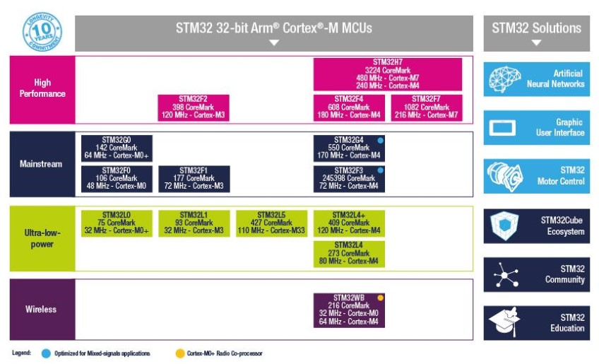
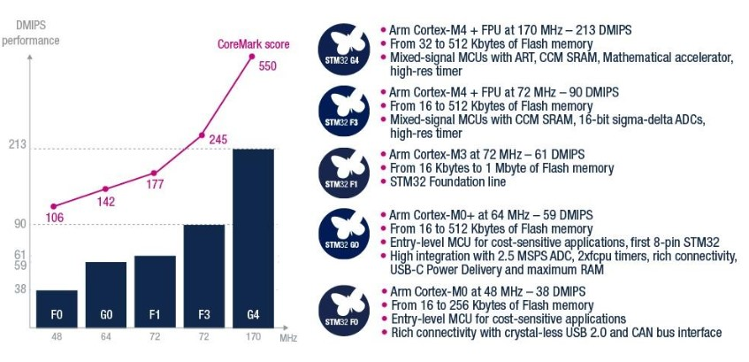
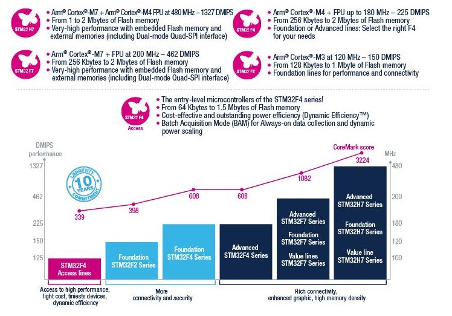

# [STM32](https://github.com/sochub/STM32) 

 
#### 厂商：[ST](https://github.com/sochub/ST)
#### 架构：[Cortex M](https://github.com/sochub/CM) 
#### 芯片定级：[Level](https://github.com/sochub/Level)

## [简介](https://github.com/sochub/STM32/wiki)

 
 
 

### [收录系列](https://github.com/sochub/STM32)

功能版本

* [STM32F0](https://github.com/sochub/STM32F0) 
* [STM32G0](https://github.com/sochub/STM32G0) 
* [STM32F1](https://github.com/sochub/STM32F1) 
* [STM32F3](https://github.com/sochub/STM32F3) 

性能版本

* [STM32F2](https://github.com/sochub/STM32F2) 
* [STM32F4](https://github.com/sochub/STM32F4) 
* [STM32F7](https://github.com/sochub/STM32F7) 
* [STM32H7](https://github.com/sochub/STM32H7) 

功耗版本

* [STM32L0](https://github.com/sochub/STM32L0) 
* [STM32L1](https://github.com/sochub/STM32L1) 

### [关联资源](https://github.com/sochub)

* [开发工具](https://github.com/sochub/SDK)
* [STM8系列](https://github.com/sochub/STM8) 

### [选型建议](https://github.com/sochub)

[STM32](https://github.com/sochub/STM32) 是消费领域非常普及的产品，拥有大量的开发资源和群体，各种工具十分便捷高效，基于cubeMX工具可以实现平台快速迁移。

##  [SoC资源平台](http://www.qitas.cn)
